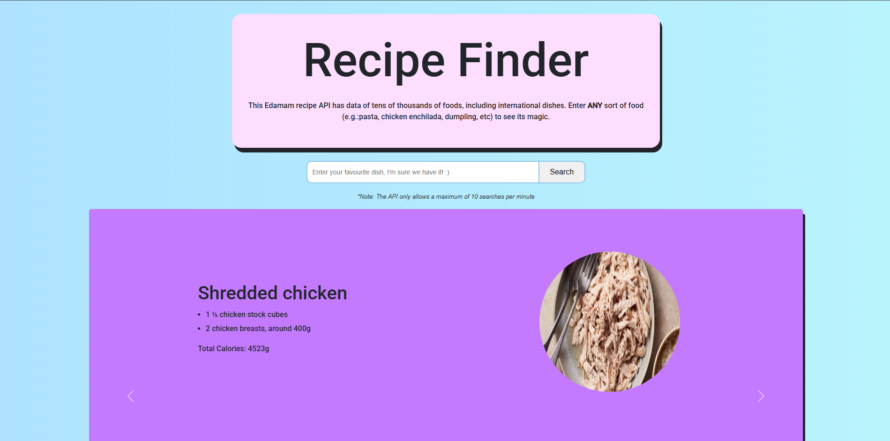
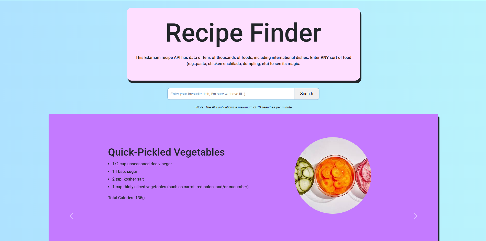
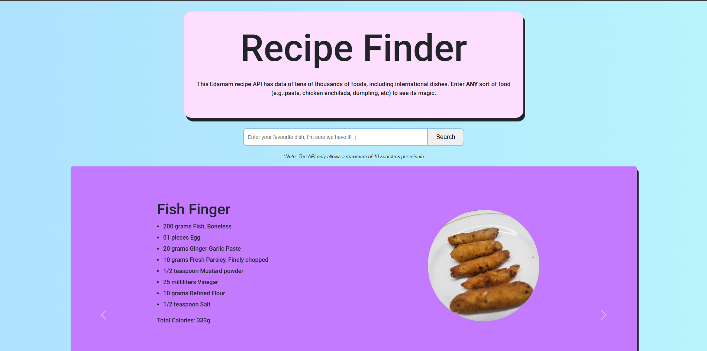

# Recipe-Search-Website

This project was a beginner project I did to help me understand the basics of making a small, full-stack Node.js web application that integrates with an external service, handles user input, and displays data dynamically in the browser. This project is a recipe search website with a basic UI and the user can search for any type of keywords in food (chicken, vegetables, fish etc.) then the application will make an API call to Edamam API to fetch data and display it in the website. Overall, this was a great learning experience for me in developing web applications. 

Concepts learned:
- Creating a basic server: Used Express to handle GET and POST requests with Express routes (app.get, app.post)
- Templating with EJS: Used EJS to render dynamic HTML and passing variables and arrays to EJS templates to display data
- Making external API calls: Used request package to fetch data from Edamam API
- Environment variables: sensitive information like API key/ID are set up in a .env file
- Error Handling: Redirects the user to an error page if the request fails

Below shows a demo for the program.

 

    

 

    

 

    

